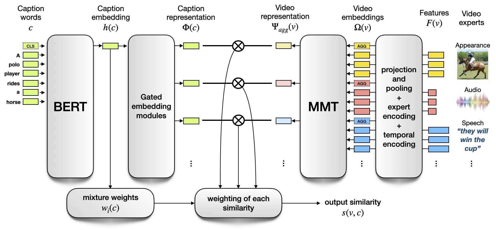

# MMT: Multi-modal Transformer for Video Retrieval



## Intro

This repository provides the code for training our video retrieval cross-modal architecture.
Our approach is described in the paper "Multi-modal Transformer for Video Retrieval" [[arXiv](https://arxiv.org/abs/2007.10639), [webpage](http://thoth.inrialpes.fr/research/MMT/)]

Our proposed Multi-Modal Transformer (MMT) aggregates sequences of multi-modal features (e.g. appearance, motion, audio, OCR, etc.) from a video. It then embeds the aggregated multi-modal feature to a shared space with text for retrieval. It achieves state-of-the-art performance on MSRVTT, ActivityNet and LSMDC datasets.

## Installing
```bash
git clone https://github.com/gabeur/mmt.git
```

## Requirements
* Python 3.7
* Pytorch 1.4.0
* Transformers 3.1.0
* Numpy 1.18.1

```bash
cd mmt
# Install the requirements
pip install -r requirements.txt
```

## ECCV paper

In order to reproduce the results of our ECCV 2020 Spotlight paper, please first download the video features from [this page](http://thoth.inrialpes.fr/research/video-features/) by running the following commands:

```bash
# Create and move to mmt/data directory
mkdir data
cd data
# Download the video features
wget http://pascal.inrialpes.fr/data2/vgabeur/video-features/MSRVTT.tar.gz
wget http://pascal.inrialpes.fr/data2/vgabeur/video-features/activity-net.tar.gz
wget http://pascal.inrialpes.fr/data2/vgabeur/video-features/LSMDC.tar.gz
# Extract the video features
tar -xvf MSRVTT.tar.gz
tar -xvf activity-net.tar.gz
tar -xvf LSMDC.tar.gz
```

You can then run the following scripts:

### MSRVTT

Training from scratch
```bash
python -m train --config configs_pub/eccv20/MSRVTT_jsfusion_trainval.json
```

### ActivityNet

Training from scratch
```bash
python -m train --config configs_pub/eccv20/ActivityNet_val1_trainval.json
```

### LSMDC

Training from scratch
```bash
python -m train --config configs_pub/eccv20/LSMDC_full_trainval.json
```

## References
If you find this code useful or use the "s3d"(motion) video features, please consider citing:
```
@inproceedings{gabeur2020mmt,
    TITLE = {{Multi-modal Transformer for Video Retrieval}},
    AUTHOR = {Gabeur, Valentin and Sun, Chen and Alahari, Karteek and Schmid, Cordelia},
    BOOKTITLE = {{European Conference on Computer Vision (ECCV)}},
    YEAR = {2020}
}
```

The features "face", "ocr", "rgb"(appearance), "scene" and "speech" were extracted by the authors of [Collaborative Experts](https://github.com/albanie/collaborative-experts). If you use those features, please consider citing:
```
@inproceedings{Liu2019a,
    author = {Liu, Y. and Albanie, S. and Nagrani, A. and Zisserman, A.},
    booktitle = {British Machine Vision Conference},
    title = {Use What You Have: Video retrieval using representations from collaborative experts},
    date = {2019}
}
```

## Acknowledgements

Our code is structured following the [template](https://github.com/victoresque/pytorch-template) proposed by @victoresque. Our code is based on the implementation of [Collaborative Experts](https://github.com/albanie/collaborative-experts), [Transformers](https://github.com/huggingface/transformers) and [Mixture of Embedding Experts](https://github.com/antoine77340/Mixture-of-Embedding-Experts).
